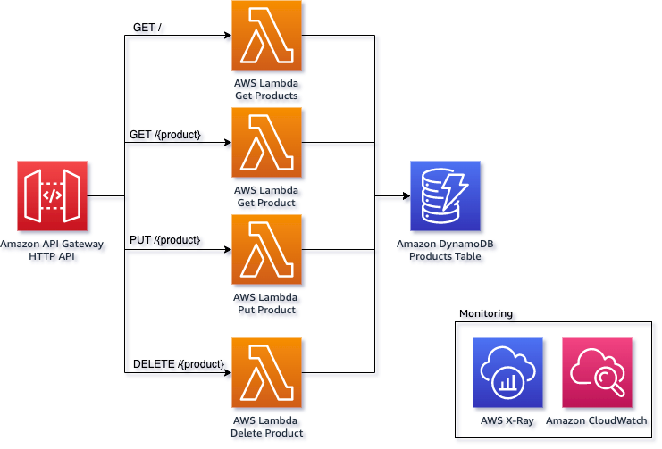
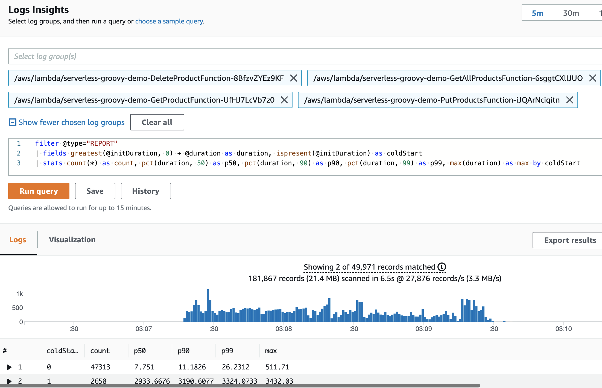
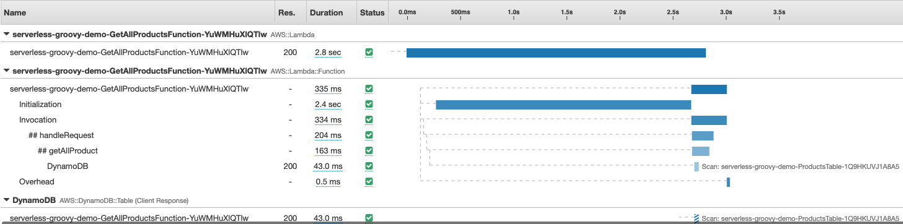
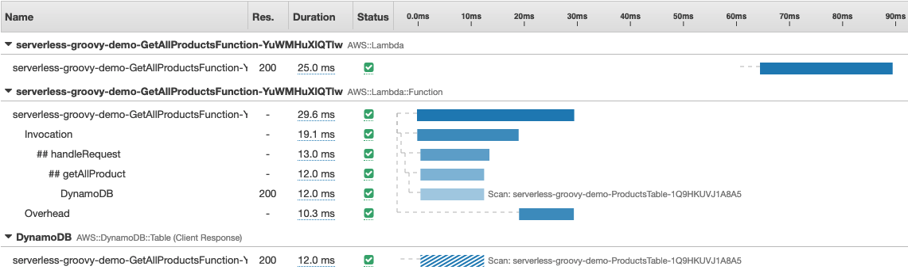

## Serverless Groovy Demo



This is a simple serverless application built in [Groovy](https://groovy-lang.org/). It consists of an
[Amazon API Gateway](https://aws.amazon.com/api-gateway/) backed by four [AWS Lambda](https://aws.amazon.com/lambda/)
functions and an [Amazon DynamoDB](https://aws.amazon.com/dynamodb/) table for storage.

## Requirements

- [AWS CLI](https://aws.amazon.com/cli/)
- [AWS SAM](https://aws.amazon.com/serverless/sam/)
- Java 11
- Groovy 4.0 (Read [release notes](https://groovy-lang.org/releasenotes/groovy-4.0.html) for breaking changes)
- [Gradle](https://gradle.org/)
- [Artillery](https://www.artillery.io/) for load-testing the application

## Infrastructure

### Tiered Compilation
The AWS Lambda functions used in this application rely on [tiered compilation](https://aws.amazon.com/blogs/compute/increasing-performance-of-java-aws-lambda-functions-using-tiered-compilation/).
After following the above blog, you should be able to create Lambda Layer and use `AWS_LAMBDA_EXEC_WRAPPER` as an environment variable for the 4 AWS Lambda functions.

### Deployment

Deploy the demo to your AWS account using [AWS SAM](https://aws.amazon.com/serverless/sam/). Use `serverless-groovy-demo` as the app/stack name.

```bash
sam build && sam deploy --guided
```

SAM will create an output of the API Gateway endpoint URL for future use in our load tests.
Make sure the app name used here matches with the `STACK_NAME` present under `load-test/run-load-test.sh`.

## Load Test

[Artillery](https://www.artillery.io/) is used to make 200 requests / second for 2 minutes to our API endpoints. You
can run this with the following command.

```bash
cd load-test
./run-load-test.sh
```

This is a demanding load test, to change the rate alter the `arrivalRate` value in `load-test.yml`.

### CloudWatch Logs Insights

Using this CloudWatch Logs Insights query you can analyse the latency of the requests made to the Lambda functions.

The query separates cold starts from other requests and then gives you p50, p90 and p99 percentiles.

```
filter @type="REPORT"
| fields greatest(@initDuration, 0) + @duration as duration, ispresent(@initDuration) as coldStart
| stats count(*) as count, pct(duration, 50) as p50, pct(duration, 90) as p90, pct(duration, 99) as p99, max(duration) as max by coldStart
```



## AWS X-Ray Tracing

X-Ray Tracing is available via [Lambda Powertools for Java](https://awslabs.github.io/aws-lambda-powertools-java/core/tracing/).

`build.gradle` dependency
```gradle
plugins{
  id 'io.freefair.aspectj.post-compile-weaving' version '6.3.0'
}

...

dependencies {
  aspect 'software.amazon.lambda:powertools-tracing:1.10.2'
}
```

Example cold start trace



Example warm start trace



## 👀 With other languages

You can find implementations of this project in other languages here:

* [🦀 Rust](https://github.com/aws-samples/serverless-rust-demo)
* [☕ Java (GraalVM)](https://github.com/aws-samples/serverless-graalvm-demo)
* [Kotlin](https://github.com/aws-samples/serverless-kotlin-demo)
* [🏗️ TypeScript](https://github.com/aws-samples/serverless-typescript-demo)
* [🐿️ Go](https://github.com/aws-samples/serverless-go-demo)
* [Micronaut, Quarkus, Springboot](https://github.com/aws-samples/serverless-java-frameworks-samples)
* [🥅 .NET](https://github.com/aws-samples/serverless-dotnet-demo)

## Security

See [CONTRIBUTING](CONTRIBUTING.md#security-issue-notifications) for more information.

## License

This library is licensed under the MIT-0 License. See the LICENSE file.

